# DUA Streamliner

> Eliminating operational manual work in the preparation of the DUA through semantic extraction, advanced OCR, and artificial intelligence.

---
## Autores

|            Nombre           | Carnet   |              Institución           |
|-----------------------------|----------|------------------------------------|
|Santiago Espinoza Rendón     |2024156530|Instituto Tecnológico de Costa Rica |
|Jose Ignacio Paniagua Vargas |2024163735|Instituto Tecnológico de Costa Rica |


**Course:** Software Design — Computer Engineering  
**Professor:** Rodrigo Núñez  
**Start Date:** March 6, 2026


---
# Dua streamliner design

## Problem
Preparing the Documento Único Aduanero (DUA) is a complex and error-prone process because the required information comes from multiple source documents such as invoices, packing lists, certificates, and transport documents. These files are usually provided in different formats (Excel, Word, PDF, or scanned images) and with inconsistent structures depending on the company or supplier. As a result, completing the DUA manually becomes repetitive, time-consuming, and highly dependent on expert knowledge, increasing the risk of delays, mistakes, or rejected declarations.
## Proposed Solution
The proposed system, called DUA Streamliner, aims to automate the generation of the DUA by allowing users to simply provide a folder containing the source documents. The system will read multiple file formats, extract both structured and unstructured data, and apply OCR for scanned documents. Using AI-based semantic analysis, it will identify relevant customs information and automatically map the extracted data to the official DUA template defined by the Ministry of Finance.
## Expected Results
The system will generate a pre-filled Word document containing the completed DUA, where each field is automatically populated and visually coded according to the confidence level of the extracted information. This approach will significantly reduce manual work and improve efficiency while still allowing customs experts to review and validate the final document. Ultimately, the solution aims to streamline the declaration process, reduce errors, and accelerate import and export procedures.


# 1. Frontend design

## 1.1 Technology stack

- Application type: Web App (Single Page Application - SPA)
- Web framework: React 19.2
- Web server: Node.js 21
- Coding Language: TypeScript 5.9.3
- Unit testing framework: Jest 30.2.0
- Data validation framework: Zod 4.3.6
- Code prettier framework: Prettier 3.8.1
- Code style framework: ESLint 10.0.2
- Integration testing tools: Playwright 1.58.2
- Cloud service: Azure Cloud Services
- Hosted services within the cloud service: Azure App Service, Azure Blob Storage
- Code repositories service: Azure DevOps Repositories
- Code automation task tool: Husky 9.1.7
- CI CD pipelines technology: Azure DevOps Pipelines
- Environments: development, stage, production
- Environment deployments tools: Azure DevOps Environments
- Observability framework: Azure Application Insights SDK

---
## 1.2  UX/UI Analysis

## Core Business Process

This section describes the step-by-step workflow of the system from the user's perspective.  
Each stage explains the actions performed by the user and the corresponding system responses.

---

# A. Login

1. The user enters their login credentials and the one-time authentication token.
2. The user attempts to authenticate.
3. If the authentication data is incorrect, the system informs the user that the credentials are invalid and requests a new attempt.
4. If the token is invalid or expired, the system informs the user that the second authentication factor is not valid and requests a new token.
5. If authentication is successful, the system grants access and takes the user to the report generation workspace.
6. The system initializes the user session and loads the initial context for the application.

**Expected UX Goal**

Provide a secure but straightforward entry point, with immediate feedback and no ambiguity about success or failure.

---

# B. Configure the Generator

1. The user starts a new report generation process.
2. The user provides the required input material, including the output template and the source documents.
3. The system validates that the required files are present and in supported formats.
4. The user defines or confirms the generation parameters, such as the report context, processing scope, or matching preferences.
5. The system analyzes the submitted configuration and checks whether the process can begin.
6. If required information is missing or inconsistent, the system explains what must be corrected.
7. If the configuration is valid, the system confirms that the generation job is ready and moves the process to the execution stage.

**Expected UX Goal**

Make the setup process understandable, reduce configuration mistakes, and ensure the user feels in control before starting analysis.

---

# C. Monitoring the Progress

1. After starting the process, the user accesses the execution status of the generation job.
2. The system shows the current processing stage for the submitted files.
3. The user reviews how the system advances through ingestion, extraction, matching, and report drafting.
4. If the process detects warnings, partial issues, or unsupported content, the system communicates them without interrupting the entire flow unless necessary.
5. The user can identify whether the generation is still in progress, completed successfully, or failed.
6. Once the process is finished, the system indicates that the final result is available for review and export.

**Expected UX Goal**

Reduce uncertainty during long-running operations and improve trust through constant visibility of progress.

---

# D. Obtain the Result / Export

1. The user accesses the completed result of the report generation process.
2. The system presents the generated report and the status of the generated content.
3. The user reviews the outcome and confirms whether the report is acceptable.
4. The user requests the final output in the required format.
5. The system prepares the exportable version of the generated document.
6. The user obtains the final report for download or further use.
7. If export fails, the system informs the user of the cause and allows another attempt.

**Expected UX Goal**

Make the final output stage feel reliable, simple, and conclusive, since this is the stage where the main business value is delivered.

---

# E. Logout

1. The user decides to end the current session.
2. The system closes the authenticated session and clears active access.
3. The user is returned to the entry point of the application.
4. The system ensures that the previous session can no longer be used without new authentication.

**Expected UX Goal**

Provide a secure and explicit session closure with a clear end to the workflow.


# Wireframes

---

## Wireframe 1 — Login Screen

### Description
This screen allows the user to securely access the application.  
The user provides authentication credentials and a one-time authentication token.  
The system validates the information and either grants access or reports authentication errors.

### AI Prompt Used
Create a grayscale low-fidelity wireframe for an enterprise web application login screen for a smart report generation system. Include areas for username, password, and one-time token authentication.

### Wireframe Image
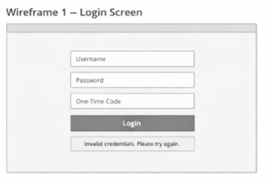

---

## Wireframe 2 — Configure Generator Screen

### Description
This screen allows the user to configure a new report generation process by providing the template document and the source files that will be analyzed by the system.

### AI Prompt Used
Create a grayscale low-fidelity wireframe for an enterprise web application where the user configures a smart report generator. Show areas for template upload, source files, and processing configuration.

### Wireframe Image
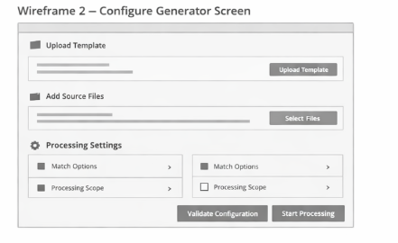

---

## Wireframe 3 — Monitoring Progress Screen

### Description
This screen allows the user to monitor the execution progress of the report generation process and observe the different stages of processing.

### AI Prompt Used
Create a grayscale low-fidelity wireframe for a monitoring dashboard that shows the progress of a document analysis and report generation job.

### Wireframe Image
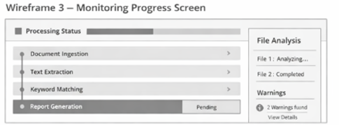

---

## Wireframe 4 — Result and Export Screen

### Description
This screen presents the final generated report and allows the user to obtain the output document.

### AI Prompt Used
Create a grayscale low-fidelity wireframe for a results screen of a smart report generation system where the user reviews the generated report and exports the document.

### Wireframe Image
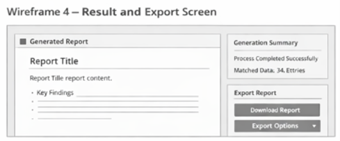

---

## Wireframe 5 — Logout Screen

### Description
This screen confirms that the user session has ended and that access to the system has been securely closed.

### AI Prompt Used
Create a grayscale low-fidelity wireframe for a logout confirmation screen in an enterprise web application.

### Wireframe Image
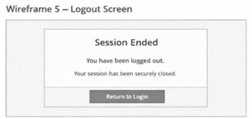


---

# UX test results
## 1. Test Participants

The usability test was conducted with **3 participants**.  
All participants were university students with basic experience using web applications.

| Participant | Background |
|-------------|------------|
| Sebastian Valverde | Mechatronics Engineering Student |
| Juan Diego Esquivel | Mechatronics Engineering Student |
| Arturo Carranza | Industrial Maintenance Engineering Student |

---

## 2. Tasks Evaluated

1. Where would you click to log into the system?
2. Where would you upload the DUA template?
3. Where would you check the progress of the document analysis?
4. Where would you download the generated report?
5. Where would you log out of the system?

---

## 3. Test Results

| Task | Success Rate | Observations |
|-----|-------------|-------------|
| Login | 100% | All participants immediately identified and clicked the login button without hesitation. |
| Upload template | 100% | Users clearly recognized the upload template section and completed the action successfully. |
| Monitor progress | 100% | Participants quickly understood the progress monitoring interface and easily located the processing status. |
| Download report | 100% | Users intuitively identified the download report option and completed the task without confusion. |
| Logout | 100% | All participants easily located the logout option and understood how to end the session. |

---

## 4. Heatmap

### Figure 1 — Login Screen Heatmap

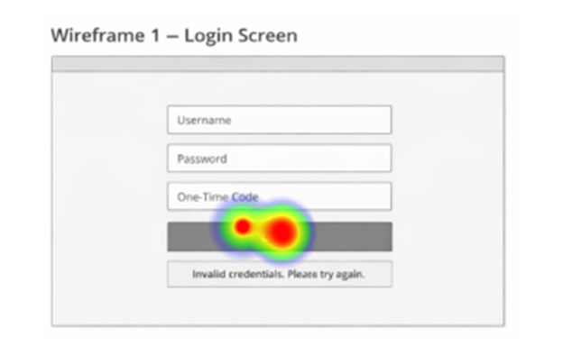

**User Clicks Table**

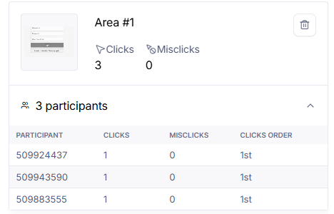

---

### Figure 2 — Configure Generator Screen Heatmap

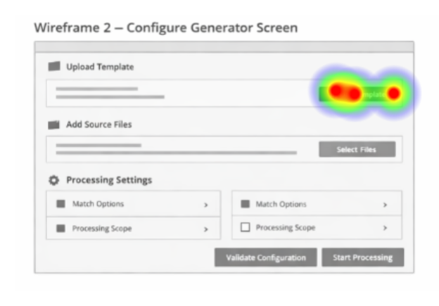

**User Clicks Table**

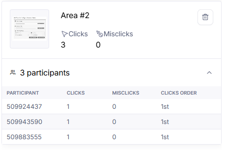

---

### Figure 3 — Monitoring Progress Screen Heatmap

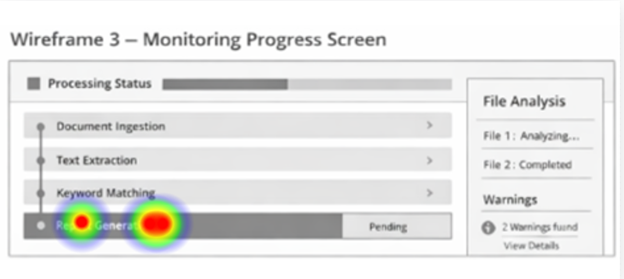

**User Clicks Table**

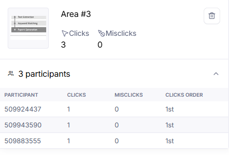

---

### Figure 4 — Result and Export Screen Heatmap

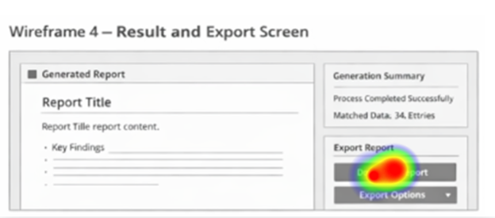

**User Clicks Table**

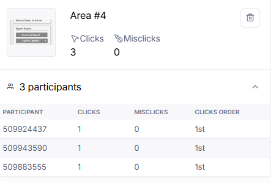

---

### Figure 5 — Logout Screen Heatmap

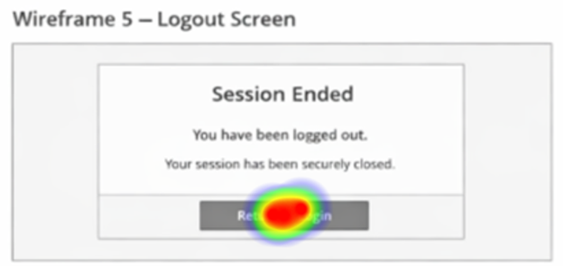

**User Clicks Table**

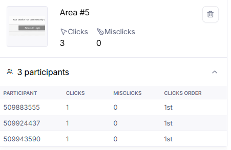

---

## 5. Conclusion

The usability test results indicate that the interface is intuitive and easy to understand. All participants were able to complete the assigned tasks successfully, which suggests that the layout and labeling of the interface clearly guide users through the main workflow of the system. The heatmap results also show that users consistently interacted with the expected interface elements. Overall, the prototype demonstrates a clear and effective design that supports the intended user actions.


# 1.3 Component design strategy

The frontend of DUA Streamliner follows a **component-based design strategy** using React and TypeScript, focused on reusability, consistency, and scalability. The design is aligned with the system workflow (login, configuration, monitoring, result, and export) and ensures that UI elements can be reused across different modules.

---

## 1.3.1 Component design technique

The system uses the **Atomic Design methodology** to structure the frontend components. This approach allows building complex interfaces from small reusable elements.

The component hierarchy is defined as follows:

- **Atoms:** basic UI elements such as buttons, inputs, labels, icons, loaders, and status badges.  
- **Molecules:** combinations of atoms, such as login forms, file upload controls, alerts, and progress indicators.  
- **Organisms:** larger UI sections such as the authentication panel, generator configuration panel, monitoring dashboard, and result display section.  
- **Templates:** layout structures that define the distribution of components within a page.  
- **Pages:** complete screens such as Login, Configure Generator, Monitoring, and Result Export.  

---

## 1.3.2 Component design principles

The following principles guide the component design:

- **Reusability:** components are designed to be reused across multiple modules.  
- **Separation of concerns:** UI components only handle presentation, while logic is handled by hooks and services.  
- **Consistency:** similar interactions and states are represented uniformly across the application.  
- **Scalability:** new features can be added without modifying existing components.  
- **Low coupling:** components do not depend directly on infrastructure or backend details.  

---

## 1.3.3 Component reuse strategy

Components are divided into two main categories:

### Shared components
Reusable across the entire application:

- `Button`  
- `Input`  
- `FileUploader`  
- `StatusBadge`  
- `Modal`  
- `ProgressBar`  
- `AlertMessage`  
- `Loader`  

### Feature components
Specific to functional modules:

- **Auth module:** login form, token validation  
- **Generator module:** template upload, document upload, configuration panel  
- **Monitoring module:** process status, stages visualization  
- **Result module:** generated report view, confidence indicators, export options  

This structure avoids duplication and ensures consistency across all system views.

---

## 1.3.4 Style centralization

CSS styles are centralized to ensure consistency and maintainability:

- A **single CSS file per component type** is used.  
- Global variables define:
  - colors  
  - typography  
  - spacing  
  - border radius  

A naming convention is applied:

``` ComponentName-StyleName ```

Examples:

- `Button-Primary`  
- `Button-Secondary`  
- `StatusBadge-Warning`  
- `Input-Error`  

---

## 1.3.5 Branding

Branding is centrally defined to maintain a consistent visual identity:

- primary and secondary colors  
- semantic colors (success, warning, error)  
- typography  
- icons  
- visual feedback rules  

In DUA Streamliner, branding is also functional, since visual indicators are used to represent:

- high confidence (green)  
- medium confidence (yellow)  
- requires review (red)  

---

## 1.3.6 Responsiveness

Responsiveness is handled by:

- using **only "em" units** for layout and spacing  
- flexible layouts (flex/grid)  
- adaptable component structures  

Although the system is mainly desktop-oriented, it supports:

- laptops  
- different screen resolutions  
- tablet-like environments  

---

## 1.3.7 Internationalization

All components support **react-i18next (v16.5.8)** for internationalization.

This includes:

- externalized text resources  
- dynamic language switching capability  
- separation between UI logic and displayed text  

---

## 1.3.8 Accessibility considerations

There are **no explicit accessibility requirements defined** for this project.  
However, basic usability practices are considered, such as clear labels, visible states, and understandable error messages.

---

## 1.3.9 Atomic design folder structure

The project structure reflects the Atomic Design approach:

```
src/
  components/
    atoms/
    molecules/
    organisms/
    templates/
    pages/
```
---

## Conclusion

The component design strategy of DUA Streamliner is based on Atomic Design, centralized styling, reusable components, consistent branding, internationalization support, and responsive layouts. This approach enables a scalable and maintainable frontend aligned with the system requirements.


# 1.4 Security

The frontend security of DUA Streamliner is designed to ensure secure access, protect user sessions, and enforce role-based functionality. Given that the system processes sensitive customs information, the security model is based on enterprise-level authentication and controlled access mechanisms.

---

## 1.4.1 Authentication

Authentication is handled using **Azure Entra ID**, providing a secure and centralized identity management solution.

The system implements:

- **Single Sign-On (SSO)** through Azure Entra ID  
- **Multi-Factor Authentication (MFA)** using a mobile authenticator application only  

The frontend does not manage user credentials directly. Instead, authentication is delegated to Azure Entra ID, reducing exposure to credential-related vulnerabilities.

**Identity server:**  
- `customsidentityserver`

---

## 1.4.2 Authorization

Authorization is implemented using **Role-Based Access Control (RBAC)**.

The system defines the following roles:

### Manager
- **Permission Code:** MANAGE_USERS  
  - Description: Manage user CRUD operations  

- **Permission Code:** VIEW_REPORTS  
  - Description: Access operational and performance reports  

- **Permission Code:** EDIT_TEMPLATES  
  - Description: Modify or update DUA templates  

---

### Customs Agent
- **Permission Code:** LOAD_FILES  
  - Description: Upload and configure input document folders  

- **Permission Code:** GENERATE_DUA  
  - Description: Start the AI-based DUA generation process  

- **Permission Code:** DOWNLOAD_DUA  
  - Description: Download the generated DUA document  

Frontend components and routes validate roles and permissions to restrict access to unauthorized actions.

---

## 1.4.3 Route protection

The application uses protected routes to enforce access control:

- **Public routes:**
  - `/login`

- **Private routes:**
  - `/generator`
  - `/monitoring`
  - `/result`

Access to private routes requires a valid authenticated session. Unauthorized users are redirected to the login page.

---

## 1.4.4 Session management

Session handling is managed centrally and includes:

- authentication token validation  
- session expiration handling  
- automatic logout when the session expires  
- manual logout by the user  
- redirection to login when the session is invalid  

This ensures that protected resources are not accessible without a valid session.

---

## 1.4.5 Security structure

The frontend security logic is organized as follows:

```
src/
security/
AuthService.ts
SessionManager.ts
PermissionService.ts
ProtectedRoute.tsx
RoleGuard.tsx
hooks/
useAuth.ts
usePermissions.ts

```

- **AuthService:** handles authentication with Azure Entra ID  
- **SessionManager:** manages session lifecycle and token validation  
- **PermissionService:** evaluates roles and permissions  
- **ProtectedRoute:** restricts access to authenticated routes  
- **RoleGuard:** enforces role-based access control in components  

---

## 1.4.6 Secure configuration

Sensitive configuration is managed using **Azure Key Vault**, which stores:

- environment variables  
- API keys  
- sensitive configuration data  

This prevents exposing secrets in the frontend codebase.

---

## 1.4.7 Input validation

All user inputs are validated before processing:

- file type validation (PDF, Word, Excel, images)  
- required field validation  
- input sanitization  

This reduces invalid data and improves system security.

---

## Conclusion

The frontend security design of DUA Streamliner integrates Azure Entra ID authentication, role-based authorization, protected navigation, secure session management, and centralized security services. The structure clearly defines responsibilities through dedicated classes and project organization, ensuring a secure, scalable, and maintainable frontend architecture.


